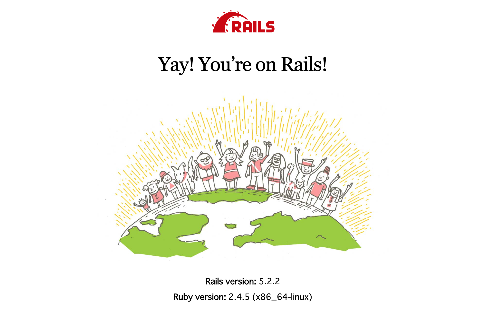

# Youtuberレビューサイト

## 概要
DockerとRuby on Railsを用いて簡易なYoutuberレビューサイトを開発する。(開発中...)

## 環境
- Docker 19.03.8
- Ruby 2.4.5
- Ruby on Rails 5.2.2
- MySQL 5.7

## 開発環境の構築

### 1. webサービスのコンテナ（=railsのコンテナ）上で後ろのコマンドを実行するコマンド + 新しいRailsプロジェクトをDockerfileで定義したappディレクトリに作成

```bash
# --forceは既存ファイルを上書きするオプション
$ docker-compose run web rails new . --force --database=mysql
$ docker-compose build # 再度Dockerfileからイメージをビルドする
```
### 2. config/database.ymlにデータベースに接続するための設定を書き、コンテナ（仮想環境）を起動させる
passwordはMY_SQL_ROOT_PASSWORD環境変数、hostはMYSQLサーバのコンテナのサービス名を追記

現在のディレクトリにあるdocker-compose.ymlに基づいてRails・MySQLコンテナを起動する
```bash
$ docker-compose up
```
### 3. 開発環境用のデータベースを作成
Rails環境にインストールされているrakeコマンドを実行し、`rake db:create`でRailsで使用するデータベースをMySQLサーバ上に作成してくれる。
```bash
$ docker-compose run web bundle exec rake db:create
```



## 開発手順
### 1. データベースにYoutuberの情報を格納
まず、Youtuberの情報として「名前」と「画像」を扱うためのProductモデルを作るマイグレーションファイルを生成する。

> マイグレーションファイルとはデータベースにテーブルを作成したり、既存のテーブルの定義を変更する場合などに使用する。
```bash
$ docker-compose run web bundle exec rails g model product name:string image_url:text
```
`app/models/product.rb `ではproductsテーブルで作成されたカラムデータを扱える。命名規則により、Productモデルはproductsテーブルと関連付いており、テーブルのレコードをProductモデルのオブジェクトとして利用できる。(O/Rマッパー)
```ruby
# アプリケーションレコードを継承したプロダクトクラスが定義されていることで、モデルとして機能させている。
class Product < ApplicationRecord
end
```
マイグレーションを実行する。
```
$ docker-compose run web bundle exec rake db:migrate
```
**スクレイピングを実行する**
```bash
$ docker exec -it review_app_web_1 bash
$ bundle exec rails c

irb(main):001:0> Scraping.get_product
```
`app/models/scraping.rb `
```ruby
class Scraping
  def self.get_product
    (1..50).each do |i|
      agent = Mechanize.new
      # ダブルクォーテーションでなければ認識されない
      page = agent.get("https://ytranking.net/?p=#{i}")
      names = page.search('.channel-list .title')
      image_urls = page.search('.channel-list img')
      names.zip(image_urls) do |name, image_url|
        name = name.inner_text
        image_url = image_url.get_attribute('src')
        product = Product.where(name: name, image_url: image_url).first_or_initialize
        product.save
      end
    end
  end
end
```

### 2. ページネーションの実装
Gemfileに`gem kaminari`を追記し、以下の順で実行する。
```
$ docker-compose build
$ docker-compose up -d
$ docker-compose exec web bundle exec rails g kaminari:config
$ docker-compose exec web bundle exec rails g kaminari:views default
```
pageメソッドを呼ぶことにより、引数に指定したページに表示するデータだけを取得する。
デフォルトでは、1ページあたり25件のデータを取得する。

```ruby
# products_controller.rb
def
  @products = Product.page(params[:page])
end
```
`app/views/products/index.html.erb`に`<%= paginate @products %>`を追記する。

※日本語表示にしたい場合はまず、

`config/application.rb`で`config.i18n.default_locale = :ja`を追記する。
```yml
# config/locales/ja.yml
ja:
  views:
    pagination:
      first: '最初'
      last: '最後'
      previous: '前'
      next: '次'
      truncate: '...'
```


### 3. レビューのモデルReviewを生成

|カラム名|データ型|用途|
|:---:|:---:|:---:|
|nickname|string|ニックネーム|
|rate|integer|評価|
|review|text|レビュー|
|product_id|integer|Youtuber_id|

```bash
$ docker-compose run web bundle exec rails g model review nickname:string rate:integer review:text product_id:integer

$ docker-compose run web bundle exec rake db:migrate
```
### 4. アソシエーションの設定
**1対多の関係**
- 1人のYoutuber(Productモデル)は複数のレビューを持っている
- 1つのレビュー(Reviewモデル)は1人のYoutuberに属している

`product.rb`
```ruby
class Product < ApplicationRecord
  has_many :reviews
end
```
`review.rb`
```ruby
class Review < ApplicationRecord
  belongs_to :product
end
```
※アソシエーションの確認
```bash
$ bundle exec rails c
```
```ruby
review = Review.first # 一番最初のレビューを取得
review.product
=> そのYoutuber情報が表示されるか
```
```ruby
review = Review.first # 一番最初のレビューを取得
product = review.product # productを変数に入れる
product.reviews
=> そのYoutuberのレビューの一覧が表示されるか
```

### 5. ユーザー認証機能
```bash
$ docker-compose exec web rails g devise:install
$ docker-compose exec web rails g devise:views
$ docker-compose exec web rails g devise user
$ docker-compose run web bundle exec rake db:migrate
```
**会員登録機能の充実**
userテーブルに画像やニックネームカラムを追加する
```bash
$ docker-compose run web bundle exec rails g migration AddImageToUsers image:string
$ docker-compose run web bundle exec rails g migration AddNicknameToUsers nickname:string
$ docker-compose run web bundle exec rake db:migrate
```
`gem 'carrierwave'`を導入
```bash
$ docker-compose run web bundle exec rails g uploader Image
```

### 6. userモデルとreviewモデル間のアソシエーション設定
ReviewモデルとUserモデルの間には**1対多の関係**がある。
```bash
$ docker-compose run web bundle exec rails g migration RemoveNicknameFromReviews nickname:string
$ docker-compose run web bundle exec rake db:migrate
```
ReviewモデルとUserモデルのアソシエーションを設定するにはReviewsテーブルにuser_idのカラムが必要になる。
```bash
$ docker-compose run web bundle exec rails g migration AddUserIdToReviews user_id:integer
$ docker-compose run web bundle exec rake db:migrate
```